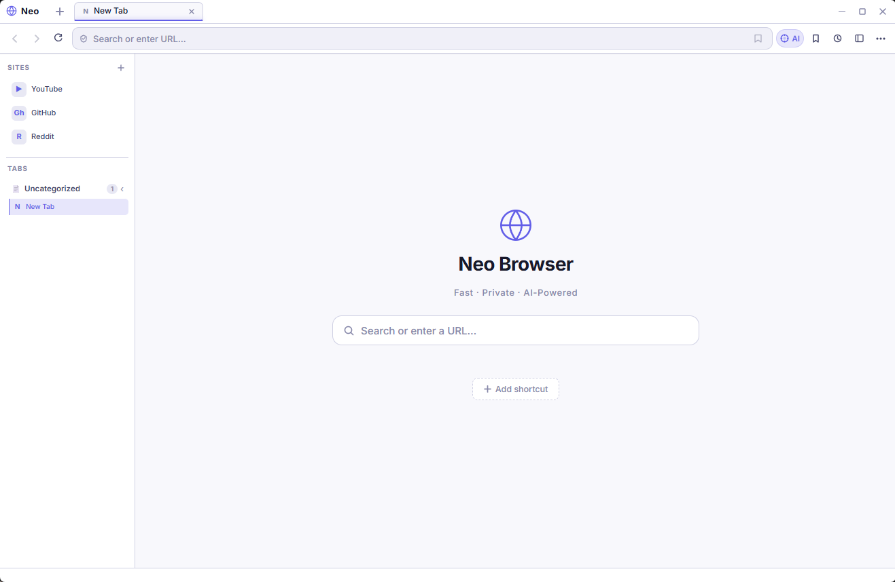
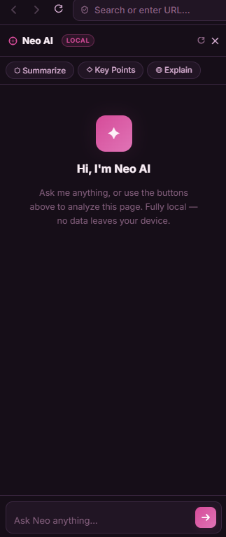
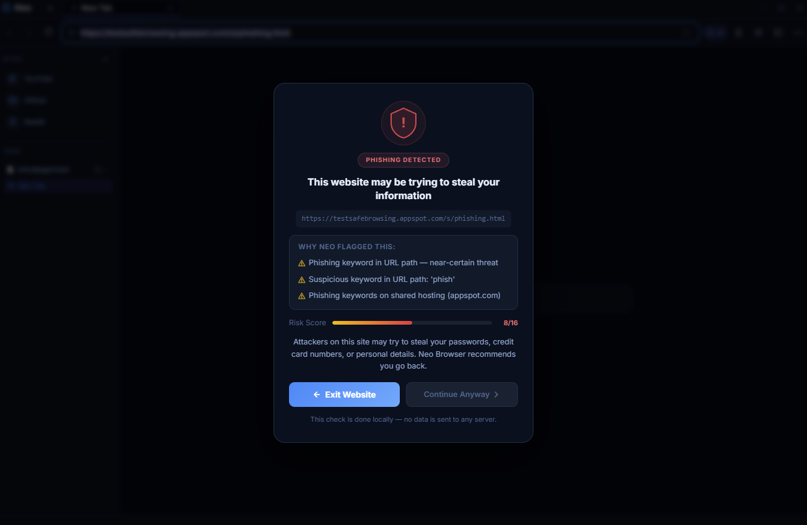
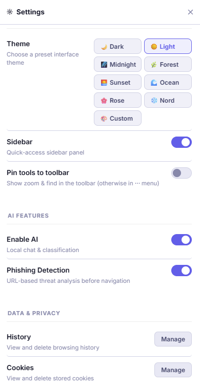

# NeoBrowser
### Smart AI Browser That Runs Fully On Your Computer

NeoBrowser is a smart web browser made using Electron and Python.

It can:
- Detect phishing websites
- Summarize webpages
- Answer questions about pages
- Classify website content
- Correct spelling mistakes
- Run AI locally on your computer

Everything works fully offline.
No API keys or paid AI services are needed.

---

## Homepage



---

## Neo AI Assistant

Ask questions about webpages or get quick summaries using the built-in AI assistant.



---

## Phishing Detection

NeoBrowser can warn you if a website looks dangerous or fake.



---

## Settings & Themes

Customize themes and browser settings easily.



---

## Features

- Offline AI assistant
- Local phishing detection
- Webpage summarization
- Smart content classification
- Spell correction
- Custom themes
- Privacy focused
- No cloud AI
- No tracking
- No API keys

---

## Technologies Used

- Electron
- Python
- Transformers
- PyTorch
- HTML
- CSS
- JavaScript

---

## Installation

### 1. Clone the repository

```bash
git clone YOUR_REPO_LINK
```

### 2. Create Python virtual environment

```bash
python -m venv venv
```

### 3. Activate virtual environment

Windows:

```bash
venv\Scripts\activate
```

Linux/macOS:

```bash
source venv/bin/activate
```

### 4. Install Python packages

```bash
pip install -r requirements.txt
```

### 5. Install Electron packages

Go inside the browser folder:

```bash
cd browser
npm install
```

### 6. Run the browser

```bash
npm start
```

---

## Project Structure

```text
NEOBROWSER/
├── README.md
├── LICENSE
├── requirements.txt
├── .gitignore
│
├── assets/
│   ├── homepage.png
│   ├── ai-panel.png
│   ├── phishing-warning.png
│   └── settings.png
│
├── ai_chat/
│   └── ai_chat_server.py
│
├── browser/
│   ├── index.html
│   ├── main.js
│   ├── preload.js
│   ├── renderer.js
│   ├── style.css
│   ├── package.json
│   └── package-lock.json
│
├── content_classifier/
│   ├── classify_content.py
│   ├── classify_with_summary.py
│   └── download_data.py
│
├── phishing_detector/
│   └── detect_phishing.py
│
└── spell_correct/
    ├── spell_correct.py
    └── frequency_dictionary_en_82_765.txt
```

---

## License

This project is licensed under the MIT License.