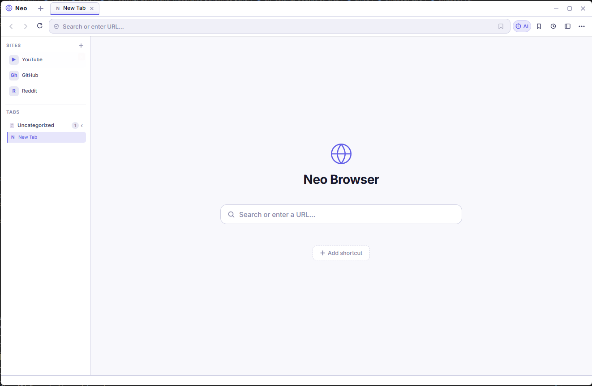
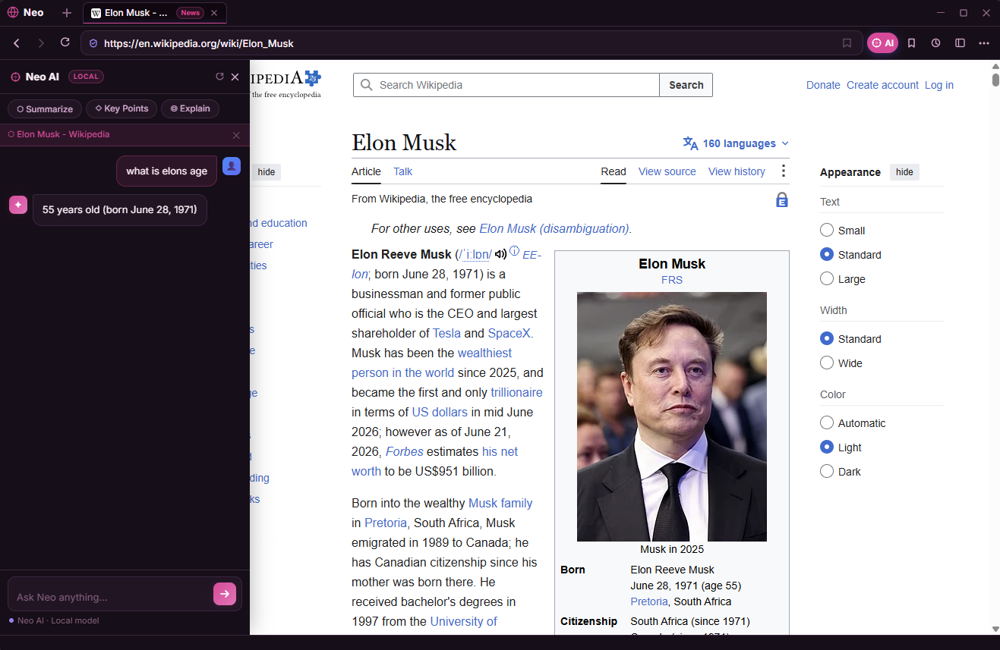
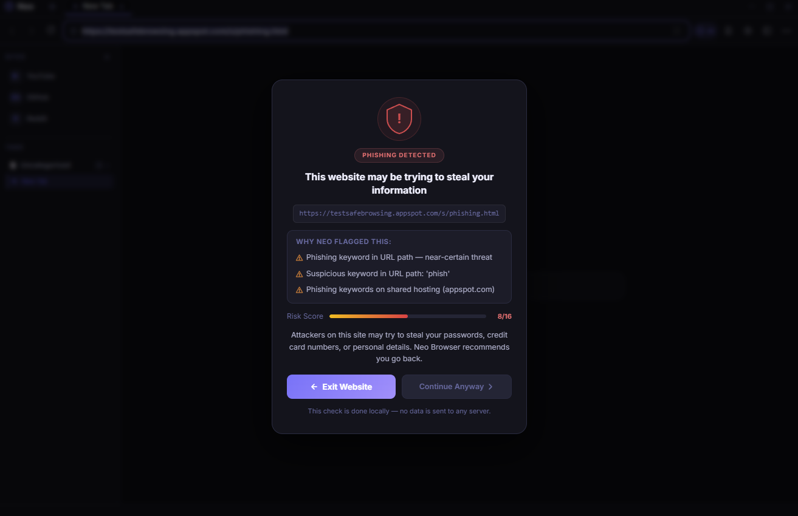
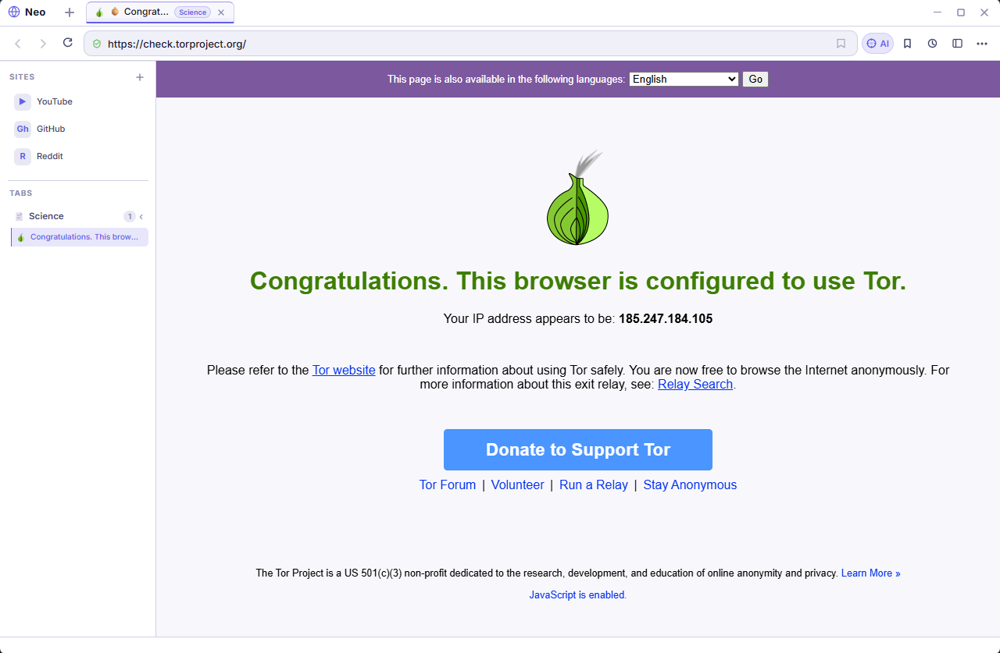
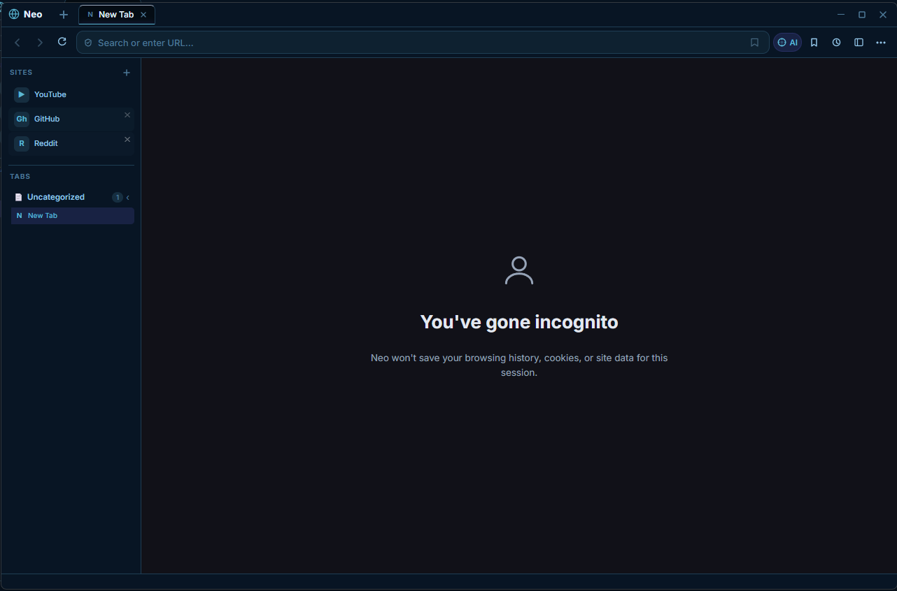
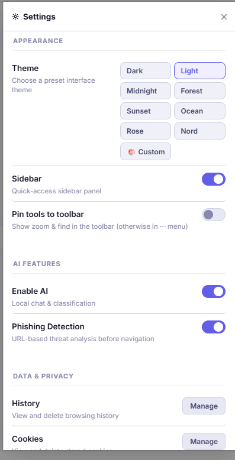
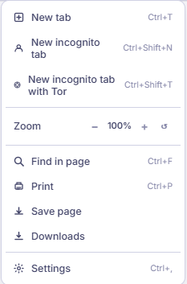

# NeoBrowser
### AI-Powered Private Desktop Browser — Runs 100% Locally

NeoBrowser is a desktop web browser built with Electron and Python. It has a built-in local AI assistant, phishing detection, incognito mode, and full **Tor network support** — all running on your own machine with no cloud services, no API keys, and no tracking.

---

## Screenshots

### Home Page


### Neo AI Assistant
Ask questions about any page or get instant summaries. Runs fully offline.



### Phishing Detection
Scans URLs before you visit and warns you with a detailed risk breakdown.



### Tor — Verified Anonymous Browsing
Tor mode routes all traffic through the Tor network. Tested and confirmed on check.torproject.org.



### Incognito Mode
No history, no cookies, no site data saved for the session.



### Settings
Multiple themes, AI toggles, phishing detection controls, and privacy tools.



### Menu
New tab, incognito, Tor tab, zoom, find, print, downloads, and settings — all in one place.



---

## Features

- **Neuro AI** — Ask questions about any webpage or get instant summaries, runs fully offline using local models (RoBERTa + DistilBART)
- **Tor Browser Mode** — Route traffic through the Tor network with one click; includes anti-fingerprinting, WebRTC blocking, and UA spoofing
- **Incognito Mode** — Standard private browsing with no history or cookies saved
- **Phishing Detection** — Scans URLs before navigation and warns you with a risk score and reasons
- **Content Classification** — Auto-categorises pages as you browse
- **Spell Correction** — Local spell checker, no cloud
- **Custom Themes** — Dark, light, midnight, forest, sunset, ocean, rose, nord, and fully custom colour themes
- **No API keys** — Everything runs on your machine
- **No telemetry** — Nothing is sent anywhere

---

## Tech Stack

| Layer | Technology |
|-------|-----------|
| Browser shell | Electron 41 |
| UI | HTML / CSS / JavaScript |
| AI models | PyTorch + Hugging Face Transformers |
| QA model | `deepset/roberta-base-squad2` |
| Summarisation | `sshleifer/distilbart-cnn-12-6` |
| Anonymity | Tor (SOCKS5 proxy + pluggable transports) |
| Phishing | Custom Python detector |
| Spell check | SymSpellPy |

---

## Installation

### Requirements

- Python 3.10 or newer
- Node.js 18 or newer
- npm
- ~2 GB free disk space (for AI models, downloaded automatically on first run)
- Tor binary (see Step 5 below)

---

### 1. Clone the repository

```bash
git clone https://github.com/YOUR_USERNAME/NeoBrowser.git
cd NeoBrowser
```

### 2. Set up Python environment

```bash
python -m venv venv
```

Activate it:

**Windows:**
```bash
venv\Scripts\activate
```

**Linux / macOS:**
```bash
source venv/bin/activate
```

### 3. Install Python dependencies

```bash
pip install -r requirements.txt
```

### 4. Install Electron dependencies

```bash
cd browser
npm install
cd ..
```

### 5. Set up Tor (for Tor tabs)

Tor binaries are not included in the repo — they are platform-specific. Download the **Tor Expert Bundle** from the official site:

👉 https://www.torproject.org/download/tor/

Extract and place the files so your folder looks like this:

```
tor/
├── tor.exe                  (Windows) or tor (Linux/macOS)
├── tor-gencert.exe          (Windows) or tor-gencert (Linux/macOS)
├── torrc                    (already included)
└── pluggable_transports/
    ├── lyrebird.exe / lyrebird
    └── conjure-client.exe / conjure-client
```

> **Linux/macOS:** make the binaries executable:
> ```bash
> chmod +x tor/tor tor/tor-gencert
> ```

### 6. Run the browser

```bash
cd browser
npm start
```

For verbose logs:
```bash
npm run dev
```

---

## AI Models

Models are downloaded automatically from Hugging Face on first launch (~800 MB total). They are cached in `ai_chat/.model_cache/` which is gitignored and never committed.

| Model | Size | Purpose |
|-------|------|---------|
| `deepset/roberta-base-squad2` | ~500 MB | Page Q&A |
| `sshleifer/distilbart-cnn-12-6` | ~300 MB | Summarisation |

---

## Project Structure

```
NeoBrowser/
├── README.md
├── requirements.txt
├── .gitignore
│
├── assets/
│   ├── home_page.png
│   ├── neo_ai.png
│   ├── phishing_detection.png
│   ├── tor_test.png
│   ├── private.png
│   ├── settings.png
│   └── menu.png
│
├── ai_chat/
│   └── ai_chat_server.py        # Local AI HTTP server (port 7788)
│
├── browser/
│   ├── main.js                  # Electron main process
│   ├── preload.js               # Context bridge (IPC)
│   ├── renderer.js              # Browser UI logic
│   ├── tor-preload.js           # Anti-fingerprint injection for Tor tabs
│   ├── index.html
│   ├── style.css
│   ├── package.json
│   └── package-lock.json
│
├── content_classifier/
│   ├── classify_content.py
│   ├── classify_with_summary.py
│   └── download_data.py
│
├── phishing_detector/
│   └── detect_phishing.py
│
├── spell_correct/
│   ├── spell_correct.py
│   └── frequency_dictionary_en_82_765.txt
│
└── tor/
    ├── torrc                        # Tor config (committed)
    ├── tor.exe / tor                # NOT committed — download separately
    ├── tor-gencert.exe              # NOT committed — download separately
    ├── data/                        # NOT committed — runtime keys & state
    └── pluggable_transports/
        ├── pt_config.json
        ├── lyrebird.exe / lyrebird  # NOT committed — download separately
        └── conjure-client.exe       # NOT committed — download separately
```

---

## Privacy & Security Notes

- **Tor data directory** (`tor/data/`) contains private circuit keys and is gitignored — never committed
- **User data** (history, bookmarks, settings, cookies) is stored in your OS user-data folder and is gitignored
- **AI models** are cached locally and gitignored — never committed
- **No API keys** are used or needed anywhere
- Tor tabs block WebRTC, spoof the User-Agent to Firefox, and inject anti-fingerprinting scripts into every page via `executeJavaScript` (runs in the main world so it actually works)
- Incognito tabs use non-persistent sessions with no history saved

---

## How Tor Mode Works

When you open a Tor tab (`Ctrl+Shift+T`):

1. A fresh non-persistent session partition is created (`tor:tab<id>`)
2. All traffic is routed through `socks5://127.0.0.1:9050` (the local Tor process started automatically on launch)
3. Request headers are rewritten to match a real Firefox UA
4. WebRTC is blocked to prevent IP leaks
5. An anti-fingerprinting script is injected into every page after load (spoofs `navigator`, plugins, canvas, WebGL, and more)

---

## License

MIT License